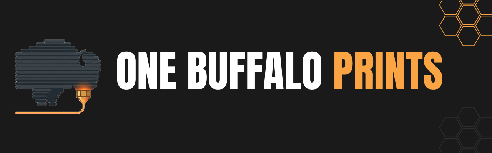

  

# One Buffalo Prints

Welcome to **One Buffalo Prints**, the open-source 3D modeling playground of **[One Buffalo Labs](https://onebuffalolabs.com)**.

Forget the promise of "consistent" updates—my output here is a lot like a real weather system off Lake Erie: incredibly bursty and highly unpredictable. I might drop a flurry of five new designs in a single weekend, and then go completely quiet for a month or two while my focus shifts back to software projects like [FilaMeter](https://filameter.com/).

This repository is strictly a passion project area. It's the central hub for all the fun toys, practical household fixes, Creality K2 SE mods, and random 3D meshes churning out of my workshop.

---

## Where to Download & Print

If you're just looking to download, slice, and get your printer running right away, you can find our pre-compiled, print-ready `.stl` and `.3mf` files on these platforms:

- **MakerWorld:** [@Bana0615](https://makerworld.com/en/@Bana0615)
- **Creality Cloud:** [@Bana0615](https://www.crealitycloud.com/user/2867011039)
- **Printables:** [@Bana0615](https://www.printables.com/@Bana0615_4259106)

## The OpenSCAD Philosophy

Sharing just an `.stl` file is like sharing a baked cake without the recipe.

By providing the original OpenSCAD (`.scad`) files right here in this repository, you have the power to tweak dimensions, adjust tolerances, and completely remix these designs to fit your exact hardware and needs.

## How This Repo is Organized

To keep the root directory clean as the collection grows, all models are sorted by category inside the `projects/` folder:

- `/projects/decor/` — Signs, logos, and display pieces.
- `/projects/functional/` — Brackets, organizers, and household fixes.
- `/projects/printer-mods/` — Upgrades and tweaks for hardware like the Creality K2 SE.
- `/projects/toys/` — Fun prints, props, and fidgets.

Inside a typical project folder (e.g., `/projects/decor/buffalo-bills-logo/`), you'll find:

- `model_name.scad` — The original, customizable OpenSCAD file.
- `model_name.stl` — The standard exported 3D mesh.
- `images/` — Renders and photos of the final printed object.
- `README.md` — Specific print settings, required hardware, and assembly guides for that exact model.

## Remixes & Community

All designs in the One Buffalo Prints repository are open-source. We highly encourage you to download, modify, and build upon these files! If you create a clever remix or add a cool new feature to one of our designs, please tag us or share your makes. We love seeing them out in the wild.

## Contributing & Issues

Because my time is split between this and larger software projects, my response time to issues will vary wildly depending on what else is on my plate. _"Eventually"_ is my guiding principle for bug fixes here.

- **Found an issue or need a tweak?** Feel free to open a ticket! Just keep in mind it might take a bit for me to get to it if I'm on a break from 3D modeling.
- **Know how to fix it yourself?** Pull Requests are highly encouraged! If you spot a problem with a mesh, have a structural improvement for a bracket, or optimized an OpenSCAD script, send a PR. I am much faster at reviewing a good model and hitting "merge" than I am at starting a fix from scratch.

## License

All models and code in this repository are released under the **Creative Commons Attribution-NonCommercial-ShareAlike 4.0 International (CC BY-NC-SA 4.0)** license.

**What this means:**

- ✅ **Share:** You are free to copy and redistribute the material in any medium or format.
- ✅ **Adapt:** You can remix, transform, and build upon the material.
- ❌ **NonCommercial:** You may **not** use the material for commercial purposes (you cannot sell the digital files or physical prints).
- 🔄 **ShareAlike:** If you remix, transform, or build upon the material, you must distribute your contributions under the exact same license as the original.

_Note: If you are interested in commercial licensing for any of these designs, please reach out to us directly through [One Buffalo Labs](https://onebuffalolabs.com)._
