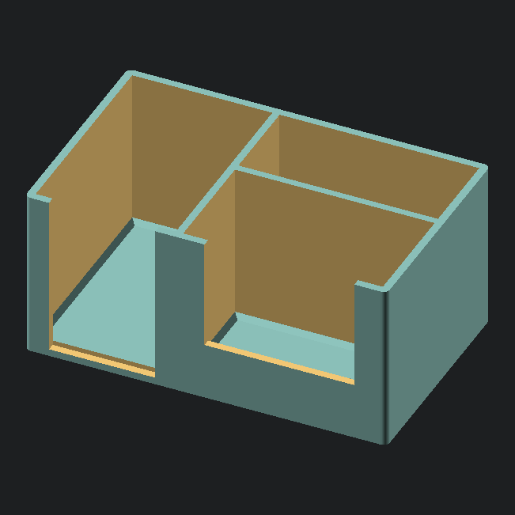

# Cold Snap Desk Caddy

Keep your card station organized and streamline your pack rips, grading submissions, and sales prep.

The **Cold Snap Desk Caddy** keeps all your essential protective supplies neatly separated and within arm’s reach on your desk mat. Built with front cutouts and a stable footprint, it lets you pinch and pull a single sleeve or case without fumbling or creasing corners.

## ✨ Features

* **3-Stage Organization:** Dedicated spots for penny sleeves, semi-rigid holders, and standard 35pt toploaders.
* **Quick-Pull Access:** Recessed front cutouts let you slide or pinch cards out smoothly without bent edges.
* **Stable Footprint:** Wide, low-profile base designed to stay planted on your desk mat even when fully stocked.

## 📦 Capacity

* ~35 Standard Toploaders
* ~45 Semi-Rigid Submission Holders (Cardboard Gold / Ultra PRO Card Savers)
* 100+ Soft Penny Sleeves

## 🖨️ Recommended Print Settings

* **Material:** PLA+ or PETG (PETG is great if your desk gets direct sunlight or sits near warm electronics)
* **Layer Height:** 0.20mm
* **Walls/Perimeters:** 3–4 for solid, sturdy pocket dividers
* **Infill:** 15% (Gyroid or Grid)
* **Supports:** None required (prints flat on the build plate)
* **Brim:** Not needed on clean, level beds

## 🔩 Hardware Required

100% 3D Printed — no screws, inserts, or extra hardware needed.

## 🛠️ Making Adjustments

If you want to tweak pocket depths or wall widths to fit thicker card cases (like 55pt–130pt toploaders), you can easily edit the dimensions right at the top of the `.scad` file.

Open the file in OpenSCAD, update the numbers at the top, press `F6` to render, and export your new STL.

## 🧩 Setup

1. Pull the print off the bed — ready to go straight from the printer.
2. Load your supplies into their slots: penny sleeves in the front, toploaders in the middle, and semi-rigids in the back.
3. Keep it right next to your playmat for quick, clutter-free card prep.

*(Cards, sleeves, and toploaders shown in photos are for demonstration purposes only and not included.)*

---

*Part of the [Cold Front Forge](https://github.com/OneBuffaloLabs/ColdFrontForge) open-source collection. Licensed under CC BY-NC-SA 4.0.*[cite: 2]

*Looking for finished physical prints or custom colors? Visit our shop: [coldfrontforge.etsy.com*](https://www.google.com/search?q=https://coldfrontforge.etsy.com/)